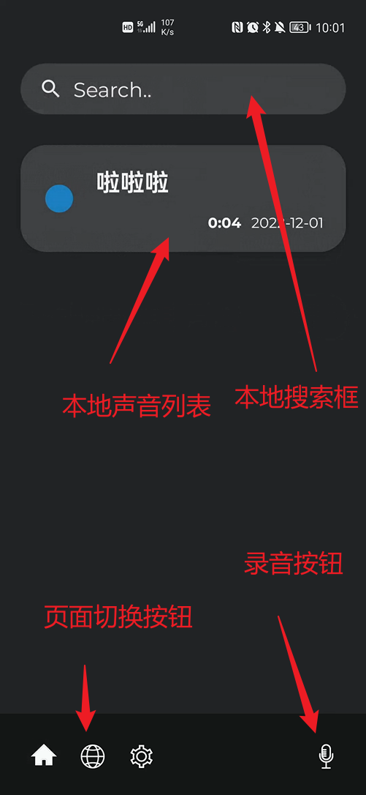
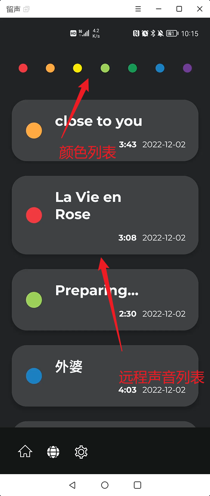

### 实现效果

本app的功能是实现本地的录音、播放，还有上传本地声音到服务器，还可以听不同的来自远程的声音。

#### 页面

分为本地，远程，设置界面

##### 本地界面

**搜索框**：输入词语，匹配本地有的声音

录音按钮：单击进入录音模式，再次单击暂停录音，在录音模式中长按停止录音，弹出保存界面

保存界面可以设置声音名字和声音的颜色

单击cancel会取消本次录音

单击save即保存声音到本地

**本地声音列表**：单击声音项会直接播放，再次单击会暂停，长按声音项会进入该声音的高亮模式

底下按钮分别是上传到远程，删除，修改信息，重复播放，以及退出高亮模式

---

##### 远程界面

最上面的颜色是为了可以筛选远程的声音的颜色

下拉刷新列表

声音播放和高亮和本地类似

---

##### 设置界面

目前有三个选项，一个是是否循环播放，第二个是切换语言，第三个是是否允许在后台播放

### 系统架构

MVVM

