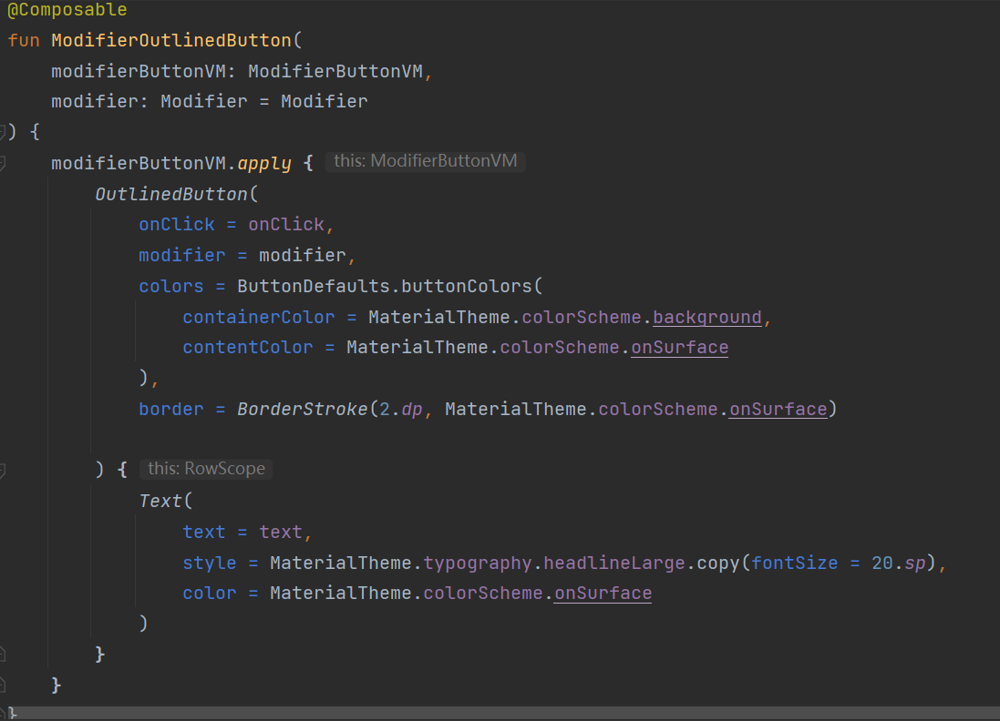

# ColorSound(留声)

## 项目背景

现在人们可以在各类社交平台上分享自己的生活，比如微信朋友圈可以分享图文信息，国外的Instagram专注于分享图片，
这些App都关注用户的视觉感受。在平时我们很在意视觉的感受，却经常会忽略听觉的感受，于是我们想做一款用户可以
记录自己的声音的App。同时，我们想保有上述这些已有的社交软件的分享功能。在我们的App中，用户可以记录生活中的声音，
同时也可以将自己录制的声音分享到网络，以及聆听其他人的分享。

## 系统架构

App 系统架构概览

UI 层

Data 层

MVVM

## 实现方法

UI使用Android Jetpack Compose进行编写。Compose是一种声明式UI框架，可以通过写kotlin函数的方式声明UI，
而不是传统的通过编辑layout的xml文件来绘制UI。使用Compose可以方便地开发 单Activity App, 单Activity相对于
传统的多Activity的好处是省去了创建新Activity以及切换Activity上下文带来的开销，以及省去了在Activity间传递数据
的麻烦。

Compose使用示例

UI层与Data层通过Android Jetpack ViewModel进行沟通，实现UI层与Data层的分离。

这里提到的UI Element对应了Compose编写的UI组件，而UI State由ViewModel存储。ViewModel向UI层传递需要
展示的数据,UI层将用户触发的事件传递到ViewModel，ViewModel处理事件，UI State发生更新，Compose重新渲染
数据发生变化的UI组件。

Data层主要有两个接口，一个是本地录音数据库的Room接口，还有一个是网络音频服务的Retrofit接口

使用自己定义的Injecter来进行依赖注入。首先在开始的Application的onCreate方法中进行依赖项初始化。

之后再service中和UI层中接入用Injecter进行注入data和service

## 实现效果

本app的功能是实现本地的录音、播放，还有上传本地声音到服务器，还可以听不同的来自远程的声音。

### 页面

分为本地，远程，设置界面

#### 本地界面

**搜索框**：输入词语，匹配本地有的声音

录音按钮：单击进入录音模式，再次单击暂停录音，在录音模式中长按停止录音，弹出保存界面

保存界面可以设置声音名字和声音的颜色

单击cancel会取消本次录音

单击save即保存声音到本地

**本地声音列表**：单击声音项会直接播放，再次单击会暂停，长按声音项会进入该声音的高亮模式

底下按钮分别是上传到远程，删除，修改信息，重复播放，以及退出高亮模式

---

#### 远程界面

最上面的颜色是为了可以筛选远程的声音的颜色

下拉刷新列表

声音播放和高亮和本地类似

---

#### 设置界面

目前有三个选项，一个是是否循环播放，第二个是切换语言，第三个是是否允许在后台播放

## 总结和展望

目前的ColorSound实现了简单的本地录音、上传音频以及播放本地和网络音频相关的功能，搭配有简约美观的
UI界面。ColorSound不足的地方是与用户的交互还较为简单，可能会缺少用户的黏性，未来可能会通过用户的
账号系统进行这方面不足的完善。
