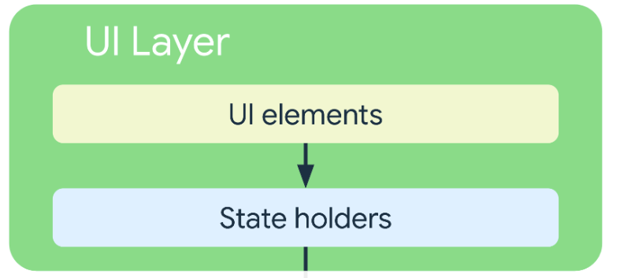
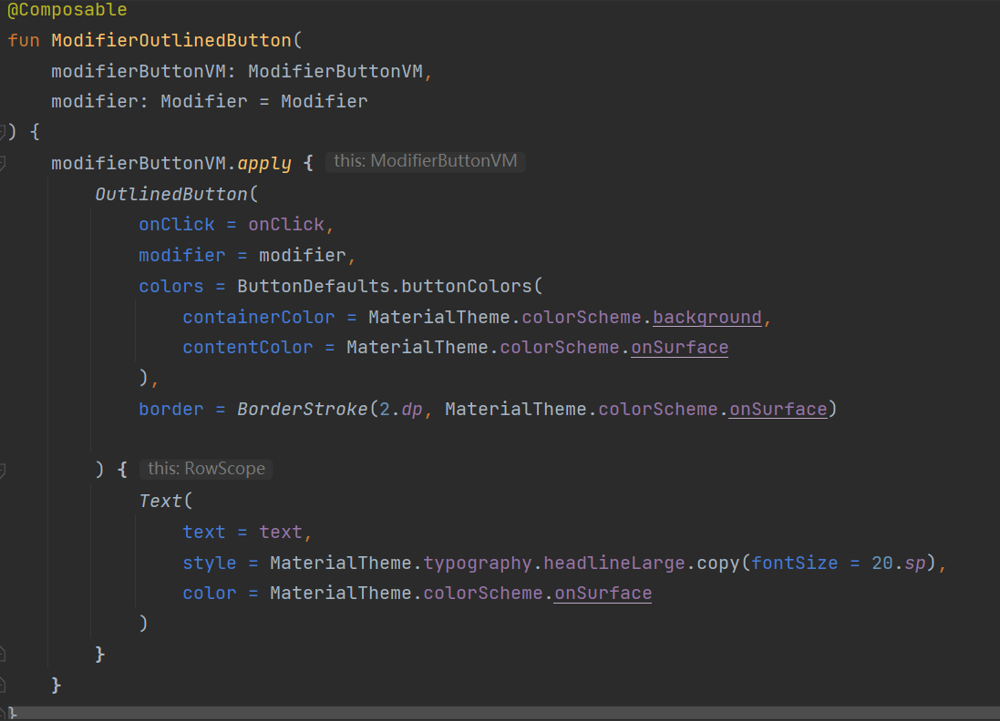
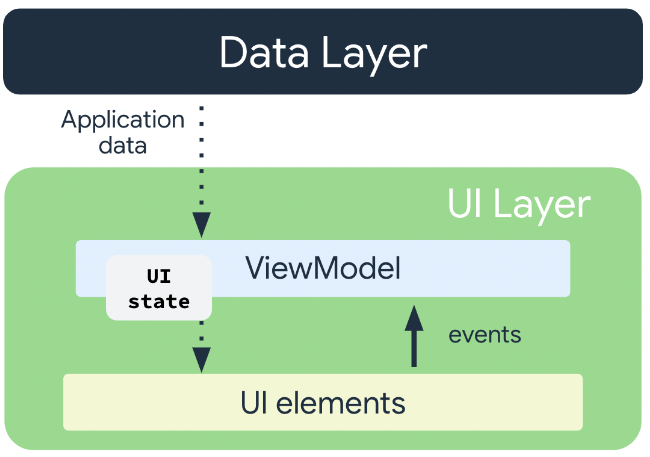

# 项目背景

现在人们可以在各类社交平台上分享自己的生活，比如微信朋友圈可以分享图文信息，国外的Instagram专注于分享图片，
这些App都关注用户的视觉感受。在平时我们很在意视觉的感受，却经常会忽略听觉的感受，于是我们想做一款用户可以
记录自己的声音的App。同时，我们想保有上述这些已有的社交软件的分享功能。在我们的App中，用户可以记录自己的声音，
同时也可以将自己录制的声音分享到网络，以及聆听其他人的分享。

# 系统架构

App Architecture Overview

UI Layer

Data Layer

# 实现方法

UI使用Android Jetpack Compose进行编写。Compose是一种声明式UI框架，可以通过写kotlin函数的方式声明UI，
而不是传统的通过编辑layout的xml文件来绘制UI。使用Compose可以方便地开发 单Activity App, 单Activity相对于
传统的多Activity的好处是省去了创建新Activity以及切换Activity上下文带来的开销，以及省去了在Activity间传递数据
的麻烦。

Compose使用示例

UI层与Data层通过Android Jetpack ViewModel进行沟通，来达到UI层与Data层的分离。

这里提到的UI Element对应了Compose编写的UI组件，而UI State由ViewModel存储。ViewModel向UI层传递需要
展示的数据,UI层将用户触发的事件传递到ViewModel，ViewModel处理事件，UI State发生更新，Compose重新渲染
数据发生变化的UI组件。

Data层主要有两个接口，一个是本地录音数据库的Room接口，还有一个是网络音频服务的Retrofit接口
